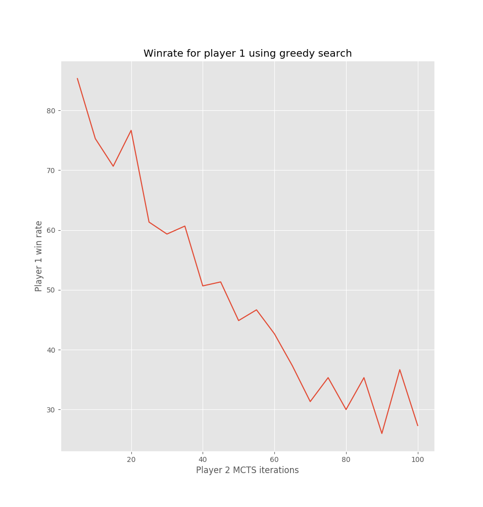
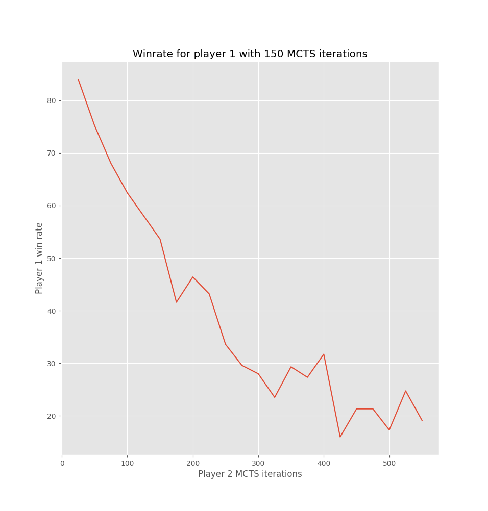
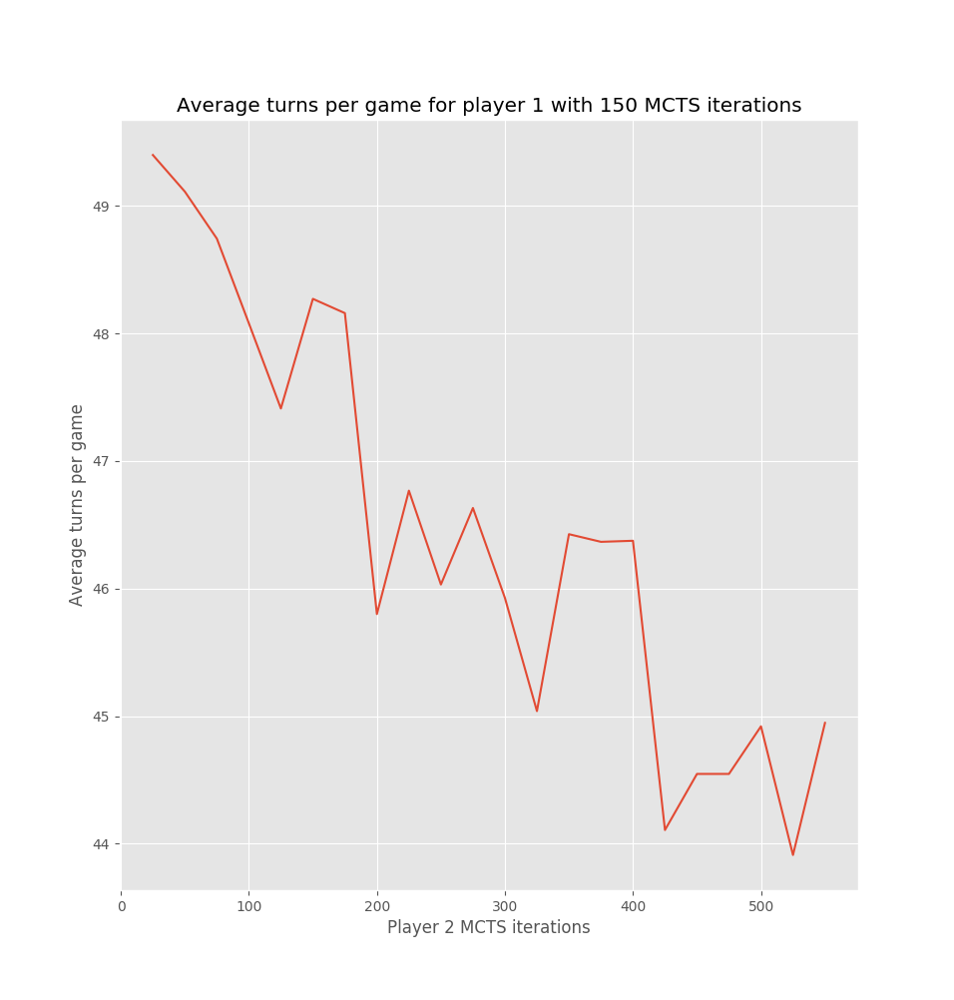

# ultimate-ttt

# Info

Ultimate tic tac toe bot implemented in Python, mainly uses the Monte Carlo tree search algorithm.

If you play against the ai please input the board positions as two ints in the range 0-8 (inclusive) seperated by a space,
for example "4 4" would play on the central square of the central board, "0 8" would play on the bottom right square of the top left board.

# Bot vs bot graphs

